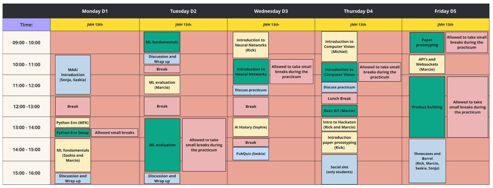

# MAAI Bootcamp

## Overview

This repository contains the supporting materials for the bootcamp for the Master of Applied AI. This bootcamp was designed for students in their initial week within the program. It is intended to review important concepts, tools and techniques.

## Content and Goals per Day

|**Day** | **Title** | **Goals**|
|---|---|---|
| **[Day 1](d1/README.md)**|Introduction, Setup and ML Review|
I want to be able to work with python environments

I want to know how to pre-process a dataset

I want to know how to do a train-test-split

I want to know how to train and test a machine learning algorithm

| **[Day 2](d2/README.md)**|Evaluation of ML|
I want to know how to evaluate an algorithm

I want to know the ML-lifecycle
|
| **[Day 3](d3/README.md)**|Basic Deep Learning and AI history|
I want to know the basics of neural networks

I want to be able to build a sequential model

I want to understand activation functions

I want to be able to preprocess data

I want to get an overview of the history of artificial intelligence|
| **[Day 4](d4/README.md)**|Computer Vision, GIT basics, and Preparations for the Hackathon|
I want to know what convolutional NN are

I want to be able to build a convolutional neural network

I want to be able to code a convolutional neural network

I want to be able to pre-process images

I want to be able to implement posthoc methods for computer vision

I want to know the basics of git

I want to be prepared for the Hackaton

I want to get introduced to paper prototyping
|
| **Day 5**|Hackaton|
I want to be able to use Flask

I want to be able to use Python websockets

I want to reflect on the past week and devise learning goals for myself

I want to be able to test a prototype
|

## Schedule

The figure below shows the proposed schedule, which is subject to slight changes depending on the allowed time, priorities and pace.

