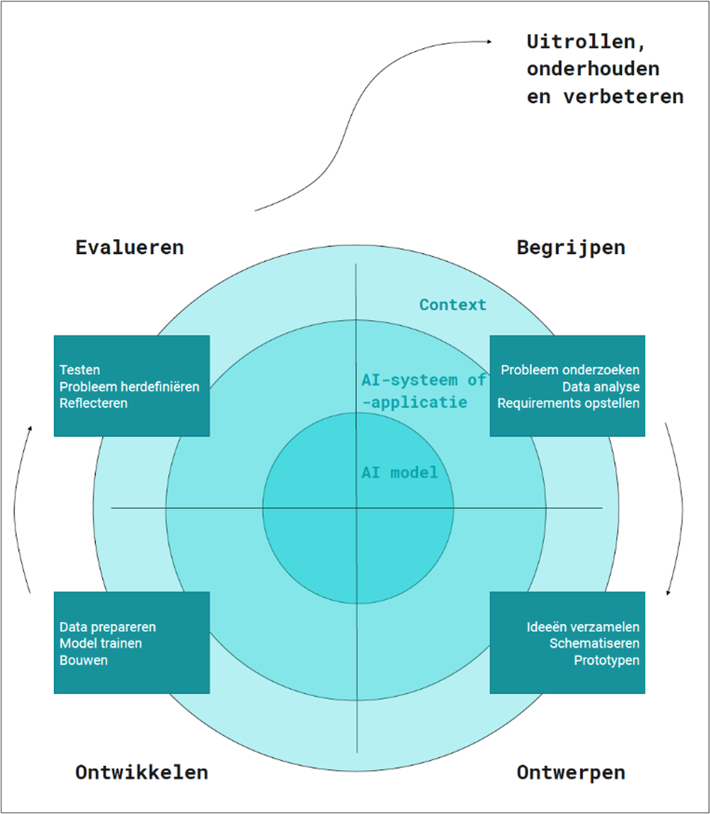

# MAAI Bootcamp :: Mini Hackathon

## Introduction

This is the last day of our bootcamp. We finish it with a Mini Hackathon, where you can work with your team, apply the knowledge you learned throughout the week, and showcase it in the end of the afternoon.

## Context

The figure below shows three concentric circles representing the main components of AI-based solutions. The inner circle represents the model. This layer can use one or more models to make predictions and generate new data. These models are sometimes chained together, with the output of one model being the input of another. The second layer represents the application or applications that use these AI models. These applications are the "glue" that links models and external actors. These actors can also be other systems. The integration, in this case, takes place through well-defined interfaces. Think, for example, of a credit card payment system (POS) that uses a fraud detection module to accept or block transactions. The end users, merchant and cardholder do not have any interaction with the model, only the POS. An actor can be a real human being, and a user interface must mediate the conversation with the model. Think of a medical application that identifies specific diseases based on MRI scans. Here, the UI should be carefully designed to show the decisions made by the model in a user-friendly and unambiguous way. aFinally, the outer circle represents the context in which the systems are running. Think of the variety of stakeholders who are directly or indirectly affected by AI solutions, such as end-users, specialists, regulatory agencies, and the government. 

## Mini Hackathon Objectives

You have worked within the inner circle in the last four days, focusing on model design and development. The objective of this Mini Hackathon is to expand one level, covering the application layer as well.

Thus, the topic of the Mini Hackathon is "Inside out: Enveloping your models into an App." The idea is to develop an AI model to perform specific tasks (e.g., classification, regression, clustering). It requires covering the steps we have seen so far. Feel free to propose the problem, approach, datasets, models, and metrics. You can get inspiration from existing sources (see Kaggle and Huggingface datasets) or use the provided datasets used throughout the boot camp.

Your team will be invited to showcase the project outcomes. During the expo, colleagues and lecturers will be able to vote on the most appealing presentation. The winner will be announced at the end of the bootcamp.
